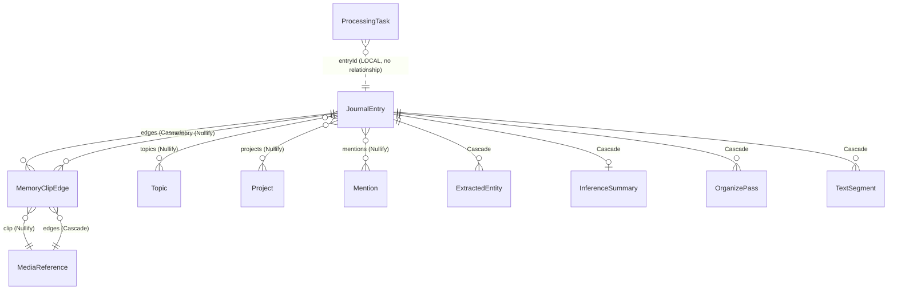

# HiMem · Engineering Design Doc (as-built)

> **Status:** as-built, 2026-07-20. Describes commit `a590dd3` on `main`.
> **Reader:** a new engineer or a handoff owner who needs the whole system in one file.
> **Two-layer rule (per the section outline):** *as-built* facts come from the repo and are cited `file:line`; *intent* is **referenced** from the design-authority docs (`CLAUDE.md`, `HiMem · Locked Decisions.html`, `Kingfisher · North Star.md`, `Kingfisher Language.md`, the per-surface specs) and never re-derived. Where code and a spec disagree, it is recorded in **§13 Divergences** — those are the highest-value findings, not smoothed over.
> **Fills:** `HiMem Engineering Doc · section outline.md`. Documentation only; no code changed to produce it.

---

## 0 · Preamble

HiMem is an iOS + watchOS **memory-keeping** app: you **capture** fragments (voice/photo/video/note), **shape** them into memories, and **build** projects that connect memories. The product is three tabs in capture→shape→build order — **Clips · Memories · Projects** = *Evidence · Context · Intent*. A clip is the atom (stored once); a memory references 1–N clips and adds a derived layer (title · summary · topics · mentions); a project connects memories. All three relationships are many-to-many. Cold launch lands on **Memories**.

The intent layer is authoritative and lives elsewhere: `CLAUDE.md` (PART 0 design authority + architecture locks), `docs/design/HiMem · Locked Decisions.html` (Architectural Invariants), `docs/design/Kingfisher · North Star.md` (philosophy), `docs/design/Kingfisher Language.md` (vocabulary), and the per-surface specs. This doc is the implementation map beneath them.

---

## 1 · Product architecture (intent layer — reference, don't re-derive)

- **Ontology** (cite `HiMem · evidence and context.md`, locked v1): **Clip = evidence · Memory = context · Project = intent.** Clip↔Memory is many-to-many with an annotated edge ("why this matters here"); Memory↔Project and Memory↔Topic are many-to-many; a clip is stored once and interpretation lives on the edge.
- **First principles that bind engineering** (cite `CLAUDE.md` §Memory perishability, §Data custody; `Kingfisher · North Star.md`):
  - **Perishability** — capture is always one action from anywhere; defer every decision that isn't "record now"; navigation is the enemy of the trigger.
  - **Capture-once-connect-many** — clips are atoms reused across memories; structure forms later, on reflective surfaces.
  - **No user content in HiMem's custody** — authoritative data lives in the user's own iCloud (private CloudKit DB + iCloud Files); the device keeps only a rebuildable index.
- **Three surfaces + navigation** (cite `CLAUDE.md` §Phone): Clips · Memories · Projects segmented in a bottom `TabView`; cold launch = Memories; the last-used tab is remembered only while the app stays alive.

---

## 2 · System topology

**Project:** `MemoryStream/MemoryStream.xcodeproj`. Product display name **HiMem**; project/dir name **MemoryStream**; bundle root **com.himem.app** (three spellings, one app).

**Six native targets:**

| Target | Type | Bundle ID | Deployment | Owns |
|---|---|---|---|---|
| MemoryStream (product "HiMem") | iOS app | `com.himem.app` | iOS 26.0 | `MemoryStream/MemoryStream/` + `Shared/` |
| Himem Watch Watch App | watchOS app | `com.himem.app.watchkitapp` | watchOS 26.0 | `MemoryStream/Himem Watch Watch App/` + `Shared/` |
| Himem Watch WidgetsExtension | watchOS app-ext | `com.himem.app.watchkitapp.Himem-Watch-Widgets` | watchOS 26.0 | `MemoryStream/Himem Watch Widgets/` |
| MemoryStreamTests | unit tests | `Himem.MemoryStreamTests` | iOS 26.4 | `MemoryStream/MemoryStreamTests/` |
| Himem Watch Watch AppTests | unit tests | — | watchOS 26.4 | watch unit suites |
| Himem Watch Watch AppUITests | UI tests | — | watchOS 26.4 | Xcode-template UI tests |

There is **no separate shared framework target.** Phone/watch code is shared by **dual target membership** of files in `MemoryStream/Shared/` (each has two `PBXBuildFile` entries + two Sources phases). Shared files: `WatchAudioSessionConfig.swift`, `ClipMetadata.swift`, `WatchSharedState.swift`, `AudioCompressor.swift`, `WatchTransferAudioTranscoder.swift`, `NextClipController.swift`, `MinClipDebouncer.swift`, `BreathCaption.swift`.

**Source layout** (`MemoryStream/MemoryStream/`): `App/` (@main + launch signposts + App Intents), `Views/` (SwiftUI, subgrouped Clip/Clips/Components/Inbox/Input/Journal/Launch/Onboarding/Pricing/Projects/Search), `Services/` (largest; subgroups AI/Entitlement/Location/Network/Notifications/Processing/Projects/Search/Storage/Transcription/Tutorials/Watch), `Models/` (Core Data entities + the `.xcdatamodeld`), `ViewModels/`, `Theme/` (`CrucibleTheme.swift`), `Assets.xcassets/` (Crucible palette color sets), `Resources/`.

**Dependencies — all Apple system frameworks; zero third-party** (no `Package.resolved`/`Podfile`/`Package.swift`; no SPM refs in the pbxproj): CloudKit (`Services/Storage/StorageService.swift` only), CoreData (Storage + Models), **FoundationModels** (`Services/Processing/OnDeviceOrganizer.swift` only — the on-device LLM), AVFoundation (audio), WatchConnectivity (`Services/Watch/WatchSessionDelegate.swift`), StoreKit (`Services/Entitlement/StoreKitService.swift`, `Views/Pricing/PricingView.swift`), NaturalLanguage (`Services/AI/LocalEntityExtractor.swift`, `Services/Search/VoiceIntentParser.swift`), Speech (`Services/Transcription/TranscriptionService.swift`, `Services/AI/SpeechService.swift`), Photos/PhotosUI (`Services/AI/CameraService.swift`, pickers). **One external HTTP service** — the organize/project-assist proxy at `https://api.thecombine.ai/himem/*` via `Services/AI/ClaudeAPIService.swift` (a remote service, not a linked dependency; see §7).

**Entry points:** iOS `App/MemoryStreamApp.swift` (`struct MemoryStreamApp: App`, `WindowGroup` → `HiMemTabView()` with `StorageService.shared.viewContext`); tab shell `Views/HiMemTabView.swift` (`Tab { clips, memories, projects }`); watch `Himem Watch Watch App/Himem_WatchApp.swift`; watch widgets `Himem Watch Widgets/Himem_Watch_WidgetsBundle.swift`.

**Build facts a new dev needs:** min iOS/watchOS **26.0** (tests 26.4); CloudKit container **`iCloud.com.himem.app`** (`StorageService.swift:101`, `UbiquityStore.swift:35`, `.entitlements`, `Info.plist:12`); production Core Data uses `NSPersistentCloudKitContainer(name: "MemoryStream")`, tests use a plain in-memory `NSPersistentContainer`. (**Flag:** the project base config still declares `IPHONEOS_DEPLOYMENT_TARGET = 17.0`; the app target overrides to 26.0 — the 17.0 baseline is stale — §13.)

---

## 3 · Data model (as-built — the core of the doc)

**Model file:** `Models/MemoryStream.xcdatamodeld/MemoryStream 3.xcdatamodel/contents` (active per `.xccurrentversion`, `userDefinedModelVersionIdentifier="3"`). **Codegen: Manual/None for every entity** — all `NSManagedObject` subclasses are hand-written under `Models/` with explicit `@NSManaged` and manually declared to-many add/remove helpers (`JournalEntry.swift:332-334`).

**CloudKit vs local (contents:142-156):** two store configurations under `NSPersistentCloudKitContainer`. **Cloud (synced):** JournalEntry, ExtractedEntity, InferenceSummary, Topic, Project, Mention, MediaReference, MemoryClipEdge, TextSegment, OrganizePass. **Local (NOT synced): `ProcessingTask` only** — a transient queue that must not sync. (Every element carries `syncable="YES"`, but store membership governs sync; every attribute is `optional="YES"` at the CD level even where the Swift `@NSManaged` type is non-optional — an intentional runtime-contract mismatch. Delete rules and `MemoryClipEdge.linkedAt` optionality are the load-bearing exceptions.)

**11 entities.** Abbreviated field lists; full detail in the model file.

**JournalEntry** (the Memory; aggregate root) — `id`, `title?`, `content`(""), `inputType`("typed"), `audioFilePath?`, `createdAt`, `sourceDevice?`("phone"), `isRecycled`(NO), **`recycledAt?`** (soft-delete), `lastViewedAt?`, `latitude?`/`longitude?`(NSNumber), `locationName?`, `lastOrganizedAt?`, `summary?`, `summaryUserEdited`(NO), `titleSourcedFromAI`(NO).
Relationships: `extractedEntities`→ExtractedEntity (to-many, **Cascade**), `edges`→MemoryClipEdge (to-many, **Cascade**), `inferenceSummary`→InferenceSummary (to-one, **Cascade**), `organizePasses`→OrganizePass (to-many, **Cascade**), `textSegments`→TextSegment (to-many, **Cascade**), `topics`→Topic (to-many, **Nullify**), `projects`→Project (to-many, **Nullify**), `mentions`→Mention (to-many, **Nullify**).
Key accessors (`JournalEntry.swift`): `mediaReferencesArray` (:209 — walks edges, `compactMap { $0.clip }`, **filters `recycledAt == nil`**), `edgesArray` (:220 — `orderInMemory` asc, `linkedAt` tiebreak, nil-safe), `projectsArray` (:193 — filters recycled projects), `latestOrganizePass`, `clipsAddedSinceLastOrganize`, `latestProcessingTask(in:)` (:246 — cross-store query into the Local ProcessingTask by `entryId`).

**MediaReference** (the clip) — `id`, `mediaType`("image"), `osIdentifier`(""), `isAccessible`(YES), `createdAt?`, `lastEditedAt?`, `rollGroupId?`, `latitude?`/`longitude?`, `placeName?`, `thumbnailCacheFilename?`, `transcript?`, `text?`, `mediaDescription?` (name avoids `NSObject.description`), `sourceDevice?`, **`recycledAt?`** (P8 soft-delete). Relationship: `edges`→MemoryClipEdge (to-many, **Cascade**), inverse `clip`. **No direct `entry` relationship** — membership lives only on the edge. Accessors: `edgesArray`, `referencingMemoryCount` (:107 — raw edge count), `mediaTypeEnum {image,voice,video,note}`.

**MemoryClipEdge** (the join / annotated edge) — `id`, `clipId`(denorm FK→MediaReference.id), `memoryId`(denorm FK→JournalEntry.id), `annotation?`, `orderInMemory`(Int16,0), **`linkedAt?`**. Relationships: `clip`→MediaReference (to-one, **Nullify**), `memory`→JournalEntry (to-one, **Nullify**). **`linkedAt` optionality is load-bearing** (`MemoryClipEdge.swift:32-44`): a non-optional accessor traps `EXC_BREAKPOINT` on a nil cell (the July 11 2026 crash); every comparison falls back to `.distantPast`. Uniqueness on `(clipId, memoryId)` is enforced **at the app layer** (`MemoryClipEdge.exists(...)`), not a CD constraint (CD unique constraints are ignored under CloudKit).

**Project** — `id`, `name`(""), `purpose?` (UI "goal"), `createdAt`, `updatedAt`, `lastThreadSummary?`, `lastThreadGeneratedAt?`, **`recycledAt?`** (soft-delete). Relationship `entries`→JournalEntry (to-many, **Nullify**).

**Topic** — `id`, `name`(""), `slug`(""), `inferredAt`, `paletteKey?`. Relationship `entries`→JournalEntry (to-many, **Nullify**). (`paletteKey`/slug are the cross-platform topic-palette contract — cite `Crucible · topic palette spec.md`.)

**Mention** — `id`, `name`(""), `type`("idea"), `normalizedName`("") (dedup key), `createdAt`. Relationship `entries`→JournalEntry (to-many, **Nullify**). `MentionType {person,place,idea,org}` (per-type SF symbol/label). Dedup on `(normalizedName, type)`.

**ExtractedEntity** — `id`, `entryId`, `entityType`("project"), `value`(""), `confidenceScore`(0), `textRangeLocation`(-1)/`textRangeLength`(0), `processingMethod`("local"), `createdAt`. Relationship `entry`→JournalEntry (to-one, **Nullify**). `EntityType {project,person,issue,idea,next_action}`.

**InferenceSummary** — `id`, `entryId`, `summaryText`(""), `feedbackState?`, `feedbackAt?`, `userCorrection?`, `createdAt`. Relationship `entry`→JournalEntry (to-one, **Nullify**). `FeedbackState {confirmed,edited,ignored}`.

**OrganizePass** (organize-result) — `id`, `entryId`, `createdAt`, `summaryText?`, `suggestedTitle?`, `suggestedTopicsJSON?`, `relatedEntryIDsJSON?`, `dismissedAt?`, `acceptedRowsJSON?`, `feedbackState?`, `feedbackAt?`, `userCorrection?`. Relationship `entry`→JournalEntry (to-one, **Nullify**). `AcceptedRowKey {title,summary,topics,mentions,nextSteps}`; `isReviewed = dismissedAt != nil || !acceptedRows.isEmpty`. **No `nextStepsMarkdown` and no `organizeVN` attribute** (removed in schema V2 — §7, §13).

**TextSegment** — `id`, `text`(""), `createdAt?`. Relationship `entry`→JournalEntry (to-one, **Nullify**).

**ProcessingTask** (LOCAL, not synced) — `id`, `entryId`, `taskType`("entity_extraction"), `status`("pending"), `progressDescription?`, `createdAt`, `processedAt?`, `errorMessage?`. **No relationships** (cross-store to JournalEntry via `entryId`); fetch index `byEntryId`.

**Delete-rule summary (load-bearing):** JournalEntry **Cascades** to its owned children (extractedEntities, edges, inferenceSummary, organizePasses, textSegments); library many-to-many relationships (topics/projects/mentions) are **Nullify** both directions so shared rows survive; MediaReference→edges is **Cascade** but each edge's `clip`/`memory` pointers are **Nullify**. Net: **no delete rule can ever destroy a shared library entity or the opposite endpoint of an edge** — only aggregate-owned children and a clip's own edges cascade.

**Derived-vs-authoritative (cite `CLAUDE.md` §Data custody):** the on-device Core Data store is a **rebuildable cache**; truth is the user's iCloud (§4). **Per-device fields that deliberately do NOT sync:** `InboxClip.reviewed` and `InboxClip.recycledAt` (manifest JSON, §5/§9), and the bench `BenchClipReviewStore` / `PreviouslyConnectedStore` (UserDefaults). These are noise-reduction signals, honest as per-device for v1; cross-device review-sync is a post-v1 property of the bench→MediaReference unification.

**ER (simplified):**

---

## 4 · Storage & custody architecture

Cite `CLAUDE.md` §Data custody and §Media specifics; `docs/design/Storage architecture · CLAUDE.md` (Option A is the single locked answer).

- **CloudKit private DB** holds structured data (memories/transcripts/topics/mentions/projects) — Apple-hosted, per-Apple-ID, developer-unreadable, survives reinstall, never in HiMem's custody. Implemented by `NSPersistentCloudKitContainer` in `StorageService.swift` (`cloudKitContainerOptions` with `containerIdentifier: iCloud.com.himem.app`, `:101`).
- **iCloud Files** (a public-document-scope ubiquity container, `NSUbiquitousContainerIsDocumentScopePublic = YES`) holds **media blobs** (voice/photo/video). Managed by `Services/Storage/UbiquityStore.swift` (`copyIntoStore`, NSFileCoordinator-wrapped) and `MediaReferenceUbiquityMigration.swift`.
- **On-device Core Data** is the derived, rebuildable index for instant search + the Memories list — the only thing HiMem keeps, containing nothing authoritative.
- **Reference integrity** between the two iCloud stores is the standing concern: a memory's private-DB metadata points at a media file in user-visible, user-mutable iCloud Files. **A missing file is a calm, honest state** ("This recording was moved or deleted"), never an error/blame; the transcript (derivative, regeneratable) makes the loss survivable.
- **Media lifecycle:** capture → iCloud Files container → download-on-demand/eviction (`UbiquityStore.downloadStatus`); survives uninstall/reinstall (same bundle ID = same container). Audio captured before the ubiquity migration is still sandbox-bound until the migration runs on that device.
- **As-built note:** the phone is the **sole iCloud writer** — the watch never writes to CloudKit or the ubiquity container; it ships media to the phone over WatchConnectivity (§6) and the phone writes both stores off the capture path.

---

## 5 · Capture pipeline

The union type every phone composer produces is `CapturedItem` (`Models/CaptureModality.swift:55`): `.voice`, `.voiceSession(clips, rollGroupId)`, `.photo`, `.video`, `.note`, `.attach`. **Routing is by which tab the FAB fired on, not by content** — `HiMemTabView.handleCapturedItem` (`:409`): `.dropOnBench` → `PhoneCaptureBenchDispatcher` (stays on Clips), `.createMemory` → `JournalCaptureCoordinator`, `.createMemoryInProject` → same + project association (the July-10 context-aware FAB; cite `CLAUDE.md` §FAB).

- **Direct voice composer** (`Views/Input/VoiceCaptureScreen.swift`) — `SpeechService` (`AVAudioEngine` + `SpeechAnalyzer`, one continuous master file) + a `NextClipController`; emits `.voiceSession` → new memory (structured capture).
- **Append composer** (`Views/Journal/EntryAppendCoordinator.swift`) — dispatches each `CapturedItem` to `EntryLifecycleService.append(...)`; on-a-roll appends each clip as its own voice fragment with honest per-clip `capturedAt`.
- **Clips-tab ad-hoc FAB** (`Services/Storage/PhoneCaptureBenchDispatcher.swift:38`) — voice grows `InboxManifest` as `InboxClip`s with `source == "phone"`; photo/video/note create **unplaced** `MediaReference`s (`insertUnplacedRef`, stamps `sourceDevice = .phone`) — ad-hoc capture that stays on Clips.
- **Note** → `.note(text)` → append `createNoteFragment` or bench unplaced `MediaReference(mediaType:.note)`.
- **Photo/video** (`CameraPickerView`, `PhotoLibraryPicker`) → `MediaReference` keyed by `osIdentifier`, media imported to the ubiquity container.

**"On a roll"** (`Shared/NextClipController.swift`) — `rollGroupId` stamped at `sessionDidStart()`, cleared at end; `handleNextTap` gated by `MinClipDebouncer` (2.0s floor). Both platforms record **one master file and split later** (`RecordingHandoff` conformances are no-ops on phone (`SpeechService:525`) and watch (`WatchRecordingService:703`)); `nextTapOffsets` carry the cut points; `VoiceClipSplitter` splits on save. `rollGroupId` overrides idle-gap sessioning. (Cite `On a roll · spec.md`; the spec's literal "recorder swap" wording vs the master-file-then-split mechanism is §13.)

**Watch capture** (`Himem Watch Watch App/WatchRecordingService.swift`) — `AVAudioEngine` input-node tap (not `AVAudioRecorder`, for true per-buffer peak); session mode `.default` (`Shared/WatchAudioSessionConfig.recordMode`, guard `WatchAudioSessionConfigTests` — never `.measurement`, which starved input gain → silent clips, cite `CLAUDE.md` §Watch Capture Session Mode); 5-min per-clip cap (`maxDuration`), 50-clip storage cap (`WatchPendingManifest.storageCap = 50`, warn at 45); wrist-off / extended-runtime-expiry auto-**saves** (never discards); no on-device transcription (clips ship empty transcript); `stop()` deliberately does not sync-drain the write queue (watchdog crash).

**sourceDevice tagging** — set `.phone` across in-app/append/bench paths and `StorageService.createEntry`; derived from clip origin on promotion so watch clips keep `.watch` (`SortBatchCommit:153`, `CreateMemoryFromClipsSheet:579/695`; watch InboxClips carry `source: metadata.source`). **One path leaves it nil:** `EntryLifecycleService.migrateOrphanedContentIfNeeded` calls `createNoteFragment` without a `sourceDevice` (§13; renders via the `.phone` fallback, so no crash).

**InboxArrivalTracker** (`Services/Storage/InboxArrivalTracker.swift`) — transient view-model over `InboxManifest` holding announce-time metadata + queue phase (`.waiting/.downloading/.transcribing/.paused`, one download at a time); `hasAnyInFlight` gates the durable-wake kick and the `SyncStrip` banner; renders `IncomingCard`s.

---

## 6 · Watch ↔ phone transfer pipeline

Cite `docs/architecture/2026-07-14-watch-audio-compression.md` and `CLAUDE.md` §Watch Audio Transfer Format. Transport is **WatchConnectivity, permanently** ("iCloud as transfer transport" is retired, not deferred).

- **Watch sender** (`Himem Watch Watch App/WatchTransferService.swift`): `send(clip:)` is the single idempotent entry; transcodes **off-main** (`Task.detached(.utility)`), then `enqueueReadyTransfer` gates on `isTransferReady` (refuses non-mono/16k/AAC), sends a pre-announce (`sendMessage` when reachable else `transferUserInfo`), then `transferFile(url, metadata:)`. Retries for source-not-finalized (0.5/2/5s) and file-missing (1/5/15s). Reachability changes trigger `flushPendingManifest()`.
- **Transcode** (`Shared/WatchTransferAudioTranscoder.swift`): whole-file, post-stop, single stateful `AVAudioConverter` pass signalling `.endOfStream` at EOF (per-callback resampling starved the resampler → silence, the reverted July-5 saga; cite `feedback_avaudioconverter_nodatanow_starves_resampler`). Target **mono / 16 kHz / AAC 32 kbps**. Two-pass: peak-scan → **pick hottest channel** (explicit N→1 downmix, retained as defensive code since `.default` already yields mono on device), then extract+resample. `isTransferReadyAndComplete(±0.5s)` guards against transcoding a still-finalizing source. Assertion guard: `WatchTransferAudioTranscoderTests`.
- **Phone receiver** (`Services/Watch/WatchSessionDelegate.swift`): `didReceive file:` decodes `ClipMetadata`, applies the B5 tombstone dedup (`status(for:) == .disposed` → ack + drop), synchronously copies into the ubiquity store (the system deletes the staging file on return), **acks immediately before async work**, then `acceptArrivedClip` → notify → transcribe → `reconcileWatchAcks`.
- **Ack protocol** (`InboxManifest.ackActions` / `emitAcks`; `WatchSessionDelegate.sendConfirmation`): wire `{"confirmed":uuid,"kind":"clip"|"rollGroup"}`; clips with a `rollGroupId` collapse to **one rollGroup ack** (split children carry fresh clipIds the watch never knew — a per-clipId ack couldn't match). `sendConfirmation` is **dual-path** (`sendMessage` + durable `transferUserInfo`). Redelivery gating is `status(for:)` across active/recycled/disposed rows; `.disposed` tombstones persist for redelivery gating; `reconcileWatchAcks` re-asserts every inbox clipId on scene-active/arrival.
- **Known issues (carry-forward, §13/§16):** the **§4c duplicate-ack storm** appears unmitigated (dual-path send + full-inbox reconcile fan-out on every arrival, no emit-side coalescing). The phone still runs each already-AAC arrived clip through `AudioCompressor.compressInPlace` (the **§4d "skip-if-AAC"** fix is not implemented — an AAC→AAC re-encode measured ~2.7× attenuation; a stale header comment still calls watch clips "raw Float32 PCM").

---

## 7 · Consolidation & organize pipeline

**Bench → session → memory.** `ClipSessionGrouper` (`Services/Storage/ClipSessionGrouper.swift`) chains loose clips newest-first by an **idle-gap** (`sessionTimeWindowSeconds = 10*60`, widened from 3 min after the CIA-dinner dogfood); a shared non-nil `rollGroupId` short-circuits to one session; `soloClipIds` (Removed-from-session) each become a single-clip group. `ClipGroup` equality is membership+content; `id = rollGroupId ?? earliest clipId`; the collapsed preview is the **first** clip's words (never a concatenation).

**Sort layer** — `ClipClusterProposer` proposes cross-session groupings (≥2 sessions): `proposeTimePlace` (hard location requirement, 90-min / 200-m single-link BFS) + `proposeWordMatch` (a token clusters only if it's a proper noun (NLTagger) OR a ≥4-char bigram; single content words excluded); `dedupByOverlap` claims greedily by signal strength and drops ≥50%-claimed proposals. `ClusterProposal.proposedName` becomes the draft-memory title. `ClusterFingerprint.derive` = SHA-256 of sorted clipIds + rule tag (**exact-set suppression only, never fuzzy**); `DismissedCluster` (`clipIds + ruleTag`) drives "Not together" with prune-on-write. `ClusterTrim` is pure view-state (removed clips just stay loose). Promotion: `SortBatchCommit` (source-aware audio move — the July-2026 data-loss fix) and `CreateMemoryFromClipsSheet` → `EntryLifecycleService.createMemoryFromVoiceClips` / `appendClips` (both reconcile `entry.content = joinedContent(from:)`; append does **not** trigger reorganize).

**Organize pass** (`Services/Processing/ProcessingEngine.swift`) — routing collapses to **try the frontier proxy iff `online && (isPlus || !hasAI)`**, else on-device AI, else NLTagger. `useOnDevice` defaults TRUE for both tiers.
- **On-device** (`Services/Processing/OnDeviceOrganizer.swift`, `import FoundationModels`, iPhone 15 Pro+/iOS 26): a `@Generable OrganizeOutput {title, summary, topics, mentions}` (**no nextSteps**) via `LanguageModelSession`; classifies opaque errors (guardrail/context-overflow/unavailable). Mentions stored untyped as `.idea` (acknowledged 3B-model limit — §13).
- **Frontier** (`Services/AI/ClaudeAPIService.swift`): **not a direct Anthropic SDK** — a proxy `POST https://api.thecombine.ai/himem/analyze` carrying `text/tier/action/existing_topics/existing_mentions`; server selects the model off `action` (`memory_organize` vs the Haiku `memory_organize_fallback`). `AnalysisResult.nextSteps` is decoded here. Wrapped by `ServerOrganizer`.
- **NLTagger fallback** (`Services/AI/LocalEntityExtractor.swift`): `NLTagger([.nameType,.lexicalClass])`, stores mentions only, marks "Processed locally."

**Prompt composition** is entirely on-device in `OnDeviceOrganizer` (the frontier prompt lives server-side, mirrored in `docs/design/mentions-server-prompt.md`): `strictPromptInstructions` = Honest-Label core + mandatory "You" POV + subject-out guard + no-causes + the **July-18 cadence rule** (peppers/tomatoes cold-vs-warm exemplar) + media-blindness + palette-preference + **palette-injection guard** ("lists are for spelling, not things to add"); `formatPrompt` injects the actual topic + mention palettes. Outputs: title/summary/topics/mentions. **`nextSteps` is Plus-only and produced only server-side.**

**Lifecycle** (`Models/OrganizePass.swift`): `isReviewed` (dismissed OR any accepted row) drives Draft-organized → Organized (**review state, not tier**); `commitReorganize` does per-field accept-or-keep (sets `titleSourcedFromAI` for title, deliberately not `summaryUserEdited`). `ProcessingEngine.processReorganize` is **title+summary only** (discards topics/mentions; NLTagger is not a reorganize fallback; failed passes change nothing). **No-auto-reprocess** is pinned (`ProcessingEngine.swift:138-140`, cite `feedback_no_auto_reprocess`) — a pass sticks until manual Reorganize.

**`EntryLifecycleService`** owns `joinedContent(from:)` (walks edges in `orderInMemory`, skips recycled clips), `regenerateContent` (after every clip add/edit/delete, and for every referencing memory on an atom edit), save/append/edit/edge-management, and the P8 recycle/restore/last-reference rule (§9).

**The `[HiMem][TranscriptWipe]` arbiter** (`EntryLifecycleService.swift`, "Aggregate-write arbiter, Finding 1"): `isAggregateWrite` asserts a clip write is **not** the memory's own joined transcript reified into one atom (predicate: ≥2 non-empty siblings AND exact normalized equality — mirrors the cleanup-migration predicate so detection/cleanup can't drift). **Non-blocking** — it NSLogs `AGGREGATE-WRITE`/`AGGREGATE-NEARMISS` with a call stack; the write proceeds. Wired at every text-write seam, including `updateClipTranscript` looping every referencing memory. The `ClipEditorCommitDecision` synchronous-seed / wipe guard (`Views/Clip/ClipEditor.swift:65-79`) returns `.skip` when a non-empty initial would be blanked (empty draft = a stale/empty-seed wipe, not a real erase — "erase = Delete this Clip, not an edit").

---

## 8 · The unified clip model

Cite `Clip model · spec.md` and `docs/architecture/2026-07-11-clip-model-convergence-plan.md`. `ClipDisplayModel` (`Views/Clip/ClipDisplayModel.swift`) is the value-typed snapshot every clip renders from — projected from three sources (`InboxClip`, `MediaReference`, `MediaDisplayItem`) without leaking Core Data lifetimes into leaf views. `ClipAtomView(model:register:)` renders in three registers — **operational** (bench: `+Ns` offset, dense), **reflective** (memory detail: `Sun May 17 · 6:12 PM`, place, audio-as-hero), **reflectiveCompact** (long-memory accordion: time-only, first-line preview) — register is a sibling parameter, never a model field (a compact-only field is a fork signal).

The **single-edit-surface invariant**: editing any clip goes through the unified `ClipEditorModal` (the one ✎ affordance everywhere); the `ClipEditorCommitDecision` guard (§7) plus the synchronous seed close the "seed pulled the composed memory transcript, then Done committed it down" data-loss class (Finding 1). Multi-select on the Clips tab uses `ClipsSelection` (shared singleton, drives the FAB-suppression gate).

---

## 9 · Editing, associations & deletion

**Unified managed-chip model** (cite `AI Organize · spec.md` §managed-chip and the unified-associations lock): topics · mentions · projects share one interaction — read chips **navigate** (topic → `TopicFilterBus`, mention → `MentionFilterBus`, project → `ProjectOpenBus`), one dashed **Edit** per section opens a per-type manage sheet (on-memory tap-remove / add / from-library / delete-from-library with impact). Glyph rule: dot = topic only; mention = per-type glyph (person/place/idea/org); project = folder.

**Deletion** (cite `CLAUDE.md` §Button & action colour code, the Trash rule): destruction is a **full-width Delete button at the bottom of an opened item**, no confirm dialog (the scroll is the deliberation) **except projects** (a light confirm); Recently Deleted (30 days) is the safety net. The label names what's destroyed: **memory → "Let Go of this Memory"**, **clip → "Delete this Clip"**, **memory-in-project → "Remove from Project"**.

**Last-reference rule (P8, locked July 19 2026 — narrowly reverses P6's "clips always survive Let Go"):** inside `EntryLifecycleService.recycle(entryId:)`, decided from **current edge counts, no history field** — a clip with `referencingMemoryCount > 1` stays; a clip whose single remaining edge is this memory moves to Recently Deleted with it. Restore is symmetric. **Detach-from-last-memory and AI reorg never auto-retire.** The Let Go button's footnote **discloses the split, never asks** (`BottomDeleteButton.letGoFootnote(stayCount:moveCount:)` computed per-memory at open time — this is a dynamic footnote, not a confirm dialog, honoring the no-dialog rule; §13 flags the "Let Go sheet" wording).

**Clip-level Recently Deleted (both backings, per-device + synced):**
- Promoted clips: `MediaReference.recycledAt` (soft), `recycleClip`/`recycleClips`/`restoreClip`/`purgeClip`/`loadRecycledClips`/`purgeExpiredRecycledClips` in `EntryLifecycleService`; excluded from every bench + memory query (`mediaReferencesArray`, `joinedContent`, unplaced/Unconnected fetches, session absorption). Rides the V8 schema deploy (§12).
- Unpromoted bench clips: `InboxClip.recycledAt` (**per-device manifest field, no deploy**), a `recycledClips` bucket in `InboxManifest` (partitioned on load, redelivery-gated via `status(for:)`/`acceptClip`), restore returns the clip to the bench and re-enters session grouping, 30-day expiry → tombstone on load.
- `RecycleBinView` shows sections per type with a shared `HiMemSegmentedControl` **type selector** (All · Clips · Memories · Projects, All default); "Empty" is global; a quiet per-filter empty line ("No deleted clips") when a filter is empty but the bin isn't. Clips carry **no "stays in your library" subline** (that's the container last-reference disclosure; a clip is the atom).

---

## 10 · Subscriptions & tiers

Cite `Pricing model · Capture-Connect-Create.md` (status: **proposal, not yet locked**). **Capture (Free) · Connect (Plus) · Create (Studio, post-launch).** Gating is on intelligence, not counts; no assist quotas.

- **`Entitlement`** (`Services/Entitlement/Entitlement.swift`) — singleton, one signal `@Published isPlus` (the entire assist-quota/packs/Founders model is retired). Binary Free/Plus only — **no Studio enum/case anywhere** (doc-only). `#if DEBUG` developer override (`himem.debug.developerOverridePlus`), surfaced as a Settings segmented picker (Real/Plus/Free).
- **What `isPlus` gates:** auto-organize-on-capture (Free mints then drops the task → manual "Organize with AI" card; `EntryLifecycleService.swift:1271`); frontier routing (`ProcessingEngine`); Siri/Shortcut auto-process; the **3-project Free cap** (`ProjectCapPolicy.freeProjectCap = 3`, **enforced** at both creation entry points); **Find the thread** (Free → PricingView; `ProjectAssistViewModel` hard-guards `isPlus`); `nextSteps` (server-only); the Find-the-thread tutorial; the C1 after-a-glance upsell. `TierMark` is display-only.
- **StoreKit 2 (real, not stubbed)** (`Services/Entitlement/StoreKitService.swift`): products `com.himem.plus.monthly` / `com.himem.plus.yearly` (no Studio product); real `product.purchase()` + `checkVerified`; `Transaction.updates` listener; restore is **implicit** via `reconcileCurrentEntitlements` on launch (no explicit "Restore Purchases" button); local `Products.storekit`. Prices come from StoreKit `displayPrice` (not hardcoded). **Functionally gated on App Store Connect** — `Product.products(for:)` returns empty until the ASC subscriptions exist; the Plus override exists to test the Plus path without a live subscription.
- **PricingView** (`Views/Pricing/PricingView.swift`): Capture (free) / Connect (Plus, `MagicTile` proof) / Create (greyed "coming later"); state-aware footer ("You're on Plus" → iOS Settings, or "Try Plus free for a week"). Free→Pricing routing from Settings, the C1 nudge, at-cap project creation, and Find-the-thread.

---

## 11 · Notifications

Cite `CLAUDE.md` §Notifications (locked May 2026, revised, **Channel B retired July 7 2026**). Intent: **one channel only — Captured Clips arrivals — always passive, one-pending, in-place update, quiet hours 10pm–7am; the Clips-tab dot is presence not count; no app-icon number.**

As-built: `Services/Notifications/NotificationService.swift` is a thin permission shim that schedules nothing; the actual scheduler is `Services/Notifications/WatchInboxNotificationCoordinator.swift`. The **Clips-tab dot** is `InboxManifest.hasUnseenArrivals` (UserDefaults-backed, set on genuinely new clipIds, cleared by `markAllSeen()` on tab select). The **app-icon badge is forced to 0** unconditionally (`syncIconBadge` ignores its argument). Channel B is fully retired; Mute-for-today + Snooze-4h inline actions exist; one-pending/in-place via stable identifiers with `removeDeliveredNotifications` before re-add; foreground suppression via `willPresent`. Onboarding shows a **single toggle** ("When clips arrive," defaulted on).

**However, the coordinator diverges materially from the locked passive-only spec** — see §13 items D1–D5 (active sound-on pushes for burst/threshold/stale; numeric badge in payloads; passive push ignores quiet hours; Settings shows a permission row not a toggle; the onboarding toggle is cosmetic). These are the highest-value notification findings.

---

## 12 · CloudKit schema versioning & deploy state

The schema is versioned by a UserDefaults **flag suffix** (`com.himem.cloudkit.schemaInitializedV<N>`, `StorageService.swift:221`). Under `#if DEBUG`, a bumped flag re-runs `initializeCloudKitSchema(options:)` on the next launch, which publishes the model to the **Development** CloudKit environment so the dashboard shows a diff; **Production is deployed manually via the CloudKit Dashboard** (cite `CLAUDE.md` §CloudKit Schema Changes).

**Version log** (`StorageService.swift:189-221`): V1 initial · V2 assist-quota retirement (removed `AssistBalance` + `OrganizePass.nextStepsMarkdown`; moved `ProcessingTask` to the Local store) · V3 `MediaReference.mediaDescription` · V5 Phase-4 clean-cut (v3 is the only model version, legacy migration removed) · **V6 `Project.recycledAt`** · **V7** B4 mentions batch (`Mention` entity + `JournalEntry.mentions` + `MediaReference.sourceDevice`) · **V8 `MediaReference.recycledAt`** (P8). Current flag: **V8**.

**Deploy state:**
- **Development:** the code publishes up to **V8** on a Debug launch (the V8 publish may itself be blocked while Apple's account migration is in progress).
- **Production:** the code comments frame V6/V7/V8 as **one pending batched pre-TestFlight deploy**; the 2026-07-18 session log records **V7 as deployed to Production**. This is an unresolved repo-internal ambiguity (§13 D-schema).
- **Open deploy: V8 `recycledAt` is held** — the ceremony (Dev → verify in dashboard → Deploy Schema Changes to Prod, before the next TestFlight) waits on Apple's account migration completing. **Do not deploy V8 to Production until the migration is done.** Note: the P8 *decision* logic is pure edge-count and needs no schema; only `MediaReference.recycledAt` needs the deploy, and `InboxClip.recycledAt` is a per-device manifest field that never deploys.

**Consequence of skipping the deploy** (cite `CLAUDE.md`): outbound sync of the new field silently breaks in TestFlight/Production — local writes save and never propagate; recycled-clip state wouldn't cross devices. Local bin visibility is unaffected (the local store lightweight-migrates the optional attribute regardless).

---

## 13 · Divergences (code vs spec) — highest-value section

Recorded for a ruling; **not resolved here.** Severity is my read.

**Notifications (highest severity — a locked-invariant + North-Star conflict):**

- **D1 · Active, sound-on pushes exist** vs `CLAUDE.md` §Notifications "always passive … never buzzes … doesn't fire a banner," one channel. `WatchInboxNotificationCoordinator` fires **three `.active` classes with `sound = .default`**: burst ≥3 clips/5min, threshold >10 inbox, stale >24h unreviewed (cap 7 fires/clip). Only the single-clip fallback is `.passive`. The stale-clip active buzz is a **nudge about an unreviewed item** — arguably also breaks the North-Star "no nudges / the app never raises the skipped thing" rule and the App Store "no nudges" promise. **Likely-right: the spec.** Cost: gate all classes to `.passive` (or delete burst/threshold/stale). *This is the single most important finding in the audit.*
- **D2 · Passive push ignores quiet hours** vs spec "first-of-stretch defers to 7am." Quiet hours (22:00–06:59) apply only to `.active` pushes; the `.passive` single-clip push fires at any hour (can land at 3am). Likely-right: the spec. Low cost.
- **D3 · Notification payloads set a numeric badge** (`content.badge = inboxCount` on passive/active/stale) vs "App-icon badge: none." `syncIconBadge` zeroes the icon on app activity, but a background push can show a number before the next zeroing. Likely-right: the spec. Low cost (set badge nil in payloads).
- **D4 · Settings shows a permission row, not a toggle** vs spec "Settings → Notifications surfaces the same single toggle." Minor wording/UX divergence.
- **D5 · The onboarding notification toggle is cosmetic** — defaults on but its state is never persisted/consulted (arrivals fire whenever OS permission is granted). Minor; either wire it or drop the toggle framing.

**Watch pipeline:**

- **D6 · Phone-side AAC→AAC re-encode** — `acceptArrivedClip` still runs the already-AAC watch clip through `AudioCompressor.compressInPlace`; the §4d "skip-if-AAC" fix is unimplemented (measured ~2.7× attenuation, wasteful). Stale header comment calls watch clips "raw Float32 PCM." Likely-right: skip-if-AAC. Medium value (audio quality).
- **D7 · §4c duplicate-ack storm appears unmitigated** — dual-path `sendConfirmation` + full-inbox `reconcileWatchAcks` fan-out on every arrival + rollGroup fan-out, no emit-side coalescing/dedup. Documented as active/unfixed in the compression doc. Medium value.
- **D8 · On-a-roll "recorder swap" wording** (spec: "the new file starts before the previous finishes flushing") vs the as-built **master-file-then-split** on both platforms (both `RecordingHandoff` no-ops). Behaviorally equivalent; a doc-wording update, not a code fix.

**Capture / model:**

- **D9 · `migrateOrphanedContentIfNeeded` leaves `MediaReference.sourceDevice == nil`** — the one capture/promotion path that doesn't stamp it (source genuinely unknown; renders via `.phone` fallback). Low; flagged low-value in the punch list.

**Organize / AI (several are *stale spec*, code ahead — worth reconciling the docs):**

- **D10 · No in-app Anthropic client / model id / keychain key** — the "frontier path" is an HTTP proxy to `api.thecombine.ai/himem/*`; model selection is server-side off the `action` field. `KeychainService` holds only `AuthService` credentials. Not a defect — but any doc/spec implying an in-app Anthropic SDK/model id is wrong.
- **D11 · `nextSteps` is decoded then dropped on-device-adjacent paths** — `OrganizePass` has **no `nextStepsMarkdown` and no `organizeVN`** (removed in V2). `storeOrganizePass` never persists `result.nextSteps`; it survives only as an `AcceptedRowKey` enum case. So the Plus `nextSteps` output is not persisted on the entity — verify the Plus surface that consumes it still works end-to-end. Medium; needs a ruling on whether nextSteps persistence is required.
- **D12 · Offline-grace / auto-reprocess is deliberately NOT built** vs `AI Organize · spec.md` §2/§9 ("frontier polish lands silently on reconnect; one pipeline, two backends"). Code pins the opposite (`feedback_no_auto_reprocess`): a pass sticks until manual Reorganize; no `FrontierOrganizer` exists. **Genuine what-level conflict** — the code decision (no silent rewrites) may be the better product call, but it contradicts the spec. **Escalate.**
- **D13 · Spec §2c "OnDeviceOrganizer ignores existingTopics" is stale** — as-built injects **both** `existingTopics` and `existingMentions` palettes. Update the spec.
- **D14 · On-device mentions are stored untyped (`.idea`)** — cannot satisfy the per-type-glyph (person/place/idea/org) associations rule for Free/on-device memories. Acknowledged 3B-model limit in code; a functional gap vs the typed-mentions spec.

**Deployment / build / stale text:**

- **D-schema · V6/V7 Production deploy ambiguity** — code comments say "pending batched Prod deploy"; the 2026-07-18 session log says V7 deployed. Reconcile the actual dashboard state (§12).
- **D15 · "Let Go sheet" wording** — the P8 directive said "sheet"; implemented as a dynamic footnote (a confirm dialog would violate the locked no-dialog deletion rule). Flagged at build time; needs Tom's confirm that the footnote is the intended surface.
- **D16 · P7 Unconnected batch was hard-delete, now soft** — resolved in P8b (both backings soft, copy fixed); listed for completeness.
- **D17 · Stale comments/refs** — assist-metering language in `EntryLifecycleService.appendClips` doc comment; "(Make a Memory · confirm sheet)" in `CreateMemoryFromClipsSheet`; the "Loose"→"Unconnected" line at `CLAUDE.md:149` (design CLAUDE.md); "raw Float32 PCM" watch header. All coherence cleanups.
- **D18 · Build hygiene** — project base `IPHONEOS_DEPLOYMENT_TARGET = 17.0` (stale; app is 26.0); `AudioCompressor.swift` has a **single** target-membership entry in `Shared/` while its siblings are dual-membership (verify it's compiled into every target that needs it).

---

## 14 · Test topology

**127 test files, 100% Swift Testing** (`import Testing`, `@Suite`/`@Test`; zero XCTest in the phone target), ~90 `@Suite`s. Watch target has its own Swift Testing suites (ack pipeline, recording level curve, waveform throttle); the only UI-test target is the Xcode template.

- **Money-test discipline** — the single load-bearing assertion an item exists to protect (e.g. `SortBatchCommitCapturedAtTests:70` "if this fails, Tom's screenshot repeats"; `DeletionSemanticsTests`, `EvidenceEdgeReadWriteTests`, `WatchDurableWakeTests`). Used across ~18 files.
- **`@Suite(.serialized)`** on ~70 suites, two documented reasons: shared non-thread-safe singletons (`InboxManifest.shared`; `LocalEntityExtractor`'s NLTagger cold-start fragility — `ProcessingEngineFallbackTests`), and per-test `NSPersistentContainer` + `@MainActor` plumbing (`StaleOnEditTests`). `ManifestTestLock` (`ManifestTestLock.swift`) is a process-wide `@MainActor` async semaphore for **cross-suite** `InboxManifest.shared` races (`.serialized` only serializes within a suite) — a discipline, not enforced; both polluting and polluted suites must `acquire()`/`release()`.
- **Env-gated calibration harness** — `OnDeviceOrganizerCalibrationTests` is `@Suite(.enabled(if: env["RUN_ODO_CALIBRATION"] != nil))`, off by default (runs the real Foundation Models model, device-only, non-deterministic); invoked with `TEST_RUNNER_RUN_ODO_CALIBRATION=1` (xcodebuild strips the `TEST_RUNNER_` prefix). Mechanical rubric checks (POV/length/banned-phrase/cadence/reuse) hard-fail; `[GRID]` lines are for human grading.
- **Seams:** `StorageService(inMemory: true)` (dedicated per-test container), `InboxManifest.debugReplaceClipsForTesting`, a protocol-stubbed `EntityExtractor`/`StubEntityExtractor` (so tests don't touch real NLTagger — unreliable on the iOS 26 simulator, cite `feedback_nltagger_simulator`).
- **Known flakes:** `VoiceIntentParserTests` has `.disabled` tests (NLTagger empty on simulator; re-enable with an injectable tagger); the "add `.serialized` when a third suite flakes" rule (`DebouncedTriggerTests`, `JournalViewModelLoadInitialTests` now serialized).

---

## 15 · Governance & process

Cite `CLAUDE.md` PART 0 and `AGENTS.md`. **Design decides *what*; the implementer decides *how* — raise concerns, don't deviate.** Two edit classes: a coherence fix (build matches an existing decision) is fine; a vocabulary/architecture/principle change needs explicit approval. Escalation chain **Agent → CC → Tom** (CC resolves implementation questions inside the locked architecture; anything that changes a *what* goes to Tom). Definition of done: *"does this express the design as specified?"* first, *"does it work?"* second — a green build that deviates is a regression.

Execution model (`AGENTS.md`): **sequential by default; dependency-aware parallelism only when earned; centralized integration; re-plan each cycle from the actual repository state.** CC is the head implementer and integration owner (owns architecture, sequencing, schema/migrations, shared interfaces, integration, and the **design-fidelity diff review** — green tests are necessary, not sufficient). Discipline enforced this session: **Bug-First** (reproduce with a failing test → verify fail → fix → verify pass), **money tests** as regression guards, **CloudKit schema ceremony** before TestFlight, additive-then-**device-verify** each slice, branch/commit discipline (each slice its own commit).

---

## 16 · Known carry-forward / deferred

From `docs/design/Handoff · carry-forward punch list · 2026-07-14.md`:

- **P1 · durable-wake kick** (top of order) — phone kicks a backgrounded watch via `transferUserInfo` on foreground+reachability; only the request half is unit-testable.
- **P2 · §8.4 PAUSED-label flicker** — needs a no-progress-in-N-seconds stall detector; its own cycle after P1.
- **P3 · synthesized-note render fail-safe** — durable guard in `migrateOrphanedContentIfNeeded` (partly addressed by the arbiter; §7).
- **P4 · swipe-retirement cleanup — (a) OPEN DECISION** for Tom: `SettingsView.swift:126 .onDelete` on Topics management — keep native `.onDelete` or convert to full-width Delete; (b)/(c) delete dead `SwipeToDelete`/`SwipeToDiscard` + scrub stale swipe doc-comments.
- **P5 · stale-comment cleanup** (D17).
- **§4c ack-storm** (D7) and **§4d skip-if-AAC** (D6) — watch-pipeline follow-ups.
- **P7 fast-follows** — mostly shipped; source-as-filter-facet deferred (YAGNI); cross-device review-sync out of v1.
- **P8 status** — shipped (last-reference rule + clip-level Recently Deleted, both backings + type selector); **V8 Prod deploy held for Apple's account migration** (§12).
- **Post-v1 candidates:** voice-register picker + AI alternative-summaries (merged; honest reframings only, "Show another" on the reorganize sheet); Studio (Create tier); project templates (cite `Project Templates · engineering design.md`).

---

## 17 · Glossary

Cite `Kingfisher Language.md` (governs verbs/questions; wins on wording).

- **Clip** — the atom of evidence; one captured fragment (voice/photo/video/note), stored once.
- **Memory** — an authored context assembled from evidence (title · summary · topics · mentions · connected clips). The brand noun; not renamed to "story" in v1.
- **Project** — user-created long-running intent ("what you're building toward"); *connects* memories, never contains them. "Collections" rejected.
- **Session** — an idle-gap grouping of clips (a "sitting"); already grouped, awaiting shaping.
- **Bench / workbench** — the Clips surface as raw materials; its question is "What needs my attention?"; the verb is **Review**, "a bench of materials, not a queue to zero."
- **Unconnected** (UI label; "Loose" internal) — a clip with `connectionCount == 0`. "Orphaned" is architecture-only, never surfaced.
- **Reviewed** — review *state*: "opened by you" (the act, not the outcome). New = `reviewed == false` (unseen).
- **Organize** — banned as a user-facing ask (the app's job). **Reorganize** — the memory's AI re-run ("Reorganize with AI ✦").
- **Find the thread** — the project's named AI action ("Find the thread ✦" / re-run "Find the thread again ✦"); never "Regenerate."
- **Let Go** — the memory-deletion verb ("Let Go of this Memory"); the derived layer dissolves, clips handled by the last-reference rule.
- **On-a-roll** — capture-continuation; the "Next" affordance keeps the next clip one tap away (`rollGroupId` overrides idle-gap sessioning).
- **Sort** — the AI-cluster suggestion surface; the AI *observes* ("these seem to belong together") + a Review action. Never "Accept."
- **Start a Memory** — the shaping verb on an already-grouped session.
- **"Where does this belong?"** — the single canonical placement question behind every clip-placement surface.
- Banned schema-leak words: Make, Create (except conscious new creation), Organize, Manage, Process, Assign, Submit, Item, Entry, Record, Object, entity.

---

*End — as-built at `a590dd3`, 2026-07-20. Corrections belong in the repo; the intent layer (CLAUDE.md, Locked Decisions, North Star, Kingfisher Language, per-surface specs) remains the authority for every *what*.*
